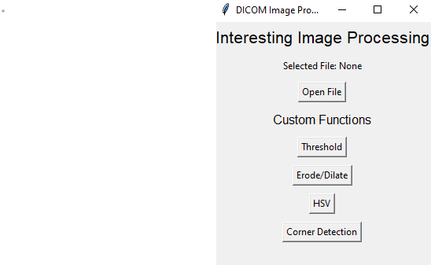
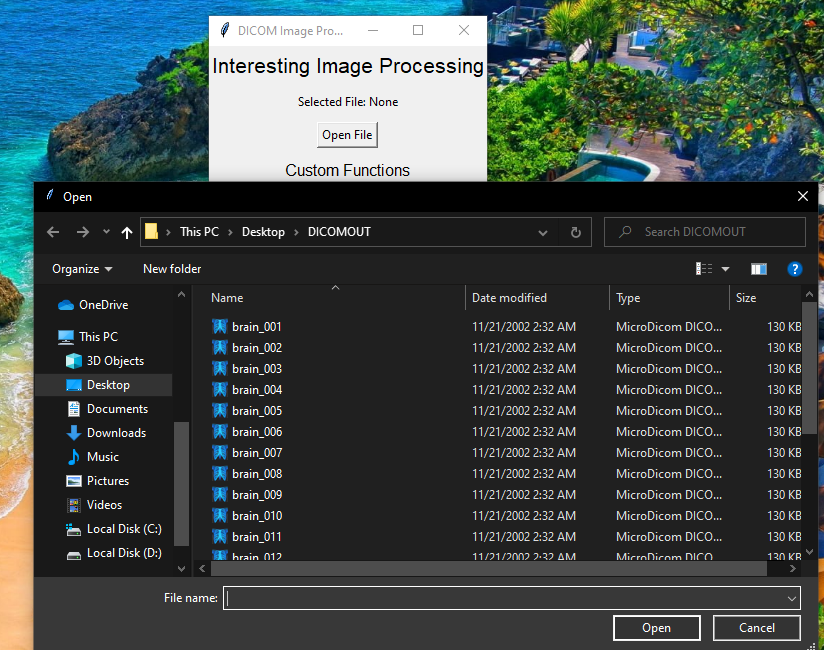
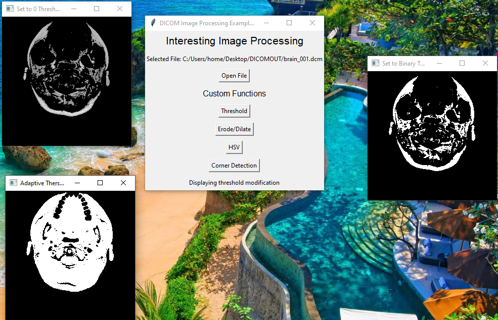
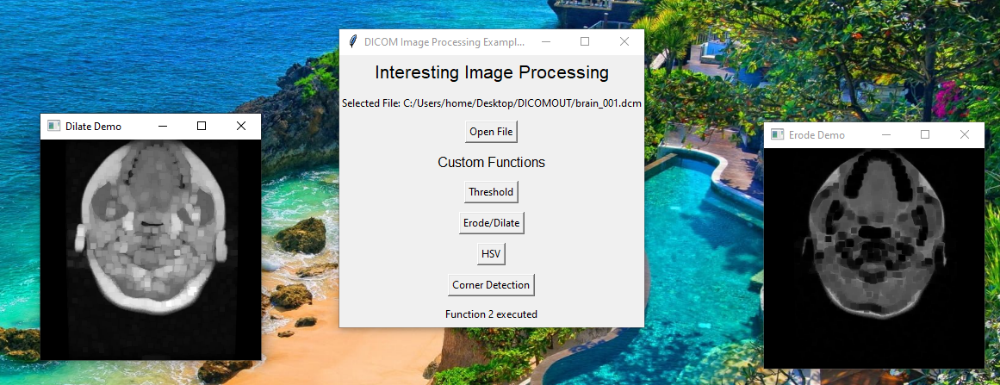
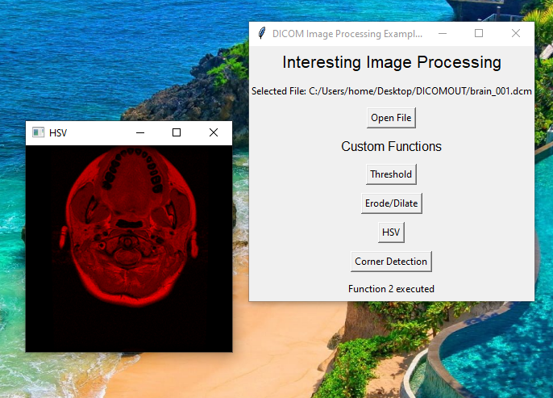
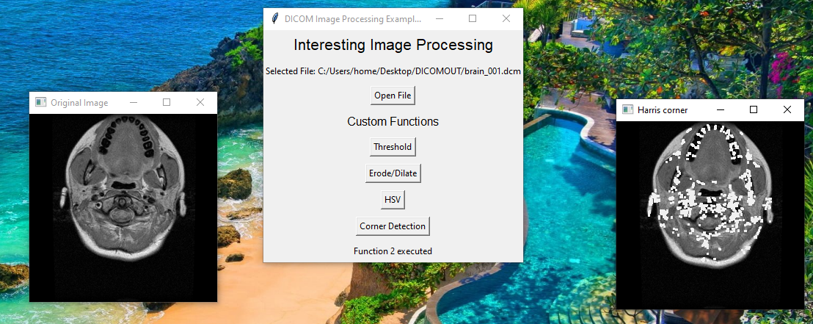

# DICOM Image Processing Toolkit

This repository contains a Python application for processing DICOM (Digital Imaging and Communications in Medicine) images. The application provides various image processing functions and tools to work with DICOM images, including thresholding, erosion/dilation, HSV color space conversion, and corner detection using the Harris corner detection algorithm.



## Features

### Open DICOM File
- Click the "Open File" button to select a DICOM file from your computer. The selected file will be displayed as "Selected File: [file_path]" on the interface.


### Thresholding
- Click the "Threshold" button to perform thresholding on the selected DICOM image. This function offers three thresholding options:
    1. Set to 0 Threshold
    2. Set to Binary Threshold
    3. Adaptive Threshold



### Erosion/Dilation
- Click the "Erode/Dilate" button to perform erosion and dilation operations on the selected DICOM image. This function demonstrates the effects of these morphological operations.



### HSV Color Space
- Click the "HSV" button to convert the selected DICOM image to the HSV (Hue, Saturation, Value) color space and display it.




### Corner Detection (Harris Corner)
- Click the "Corner Detection" button to apply the Harris corner detection algorithm to the selected DICOM image. Detected corners are marked in the output image.




## Getting Started

To run this application on your local machine, follow these steps:

1. Clone this repository to your computer:

```
git clone https://github.com/Tejas-MD/Compvision-MRI-DICOM.git
```

2. Install the required Python packages using pip:

```
pip install -r requirements.txt
```

3. Run the `dicom_image_processing.py` script:

```
python dicom_image_processing.py
```

4. Use the application to open a DICOM file and apply various image processing functions.

## Requirements

- Python 3.x
- tkinter
- matplotlib
- pydicom
- numpy
- PIL (Pillow)
- opencv-python (cv2)

## Contribution

Contributions to this DICOM image processing toolkit are welcome! If you have any ideas for improvements or new features, please feel free to open an issue or submit a pull request.


**Disclaimer:** This application is intended for educational and demonstration purposes. Always ensure that you have the necessary rights and permissions to process and modify medical images, and consult with medical professionals for any clinical applications.

